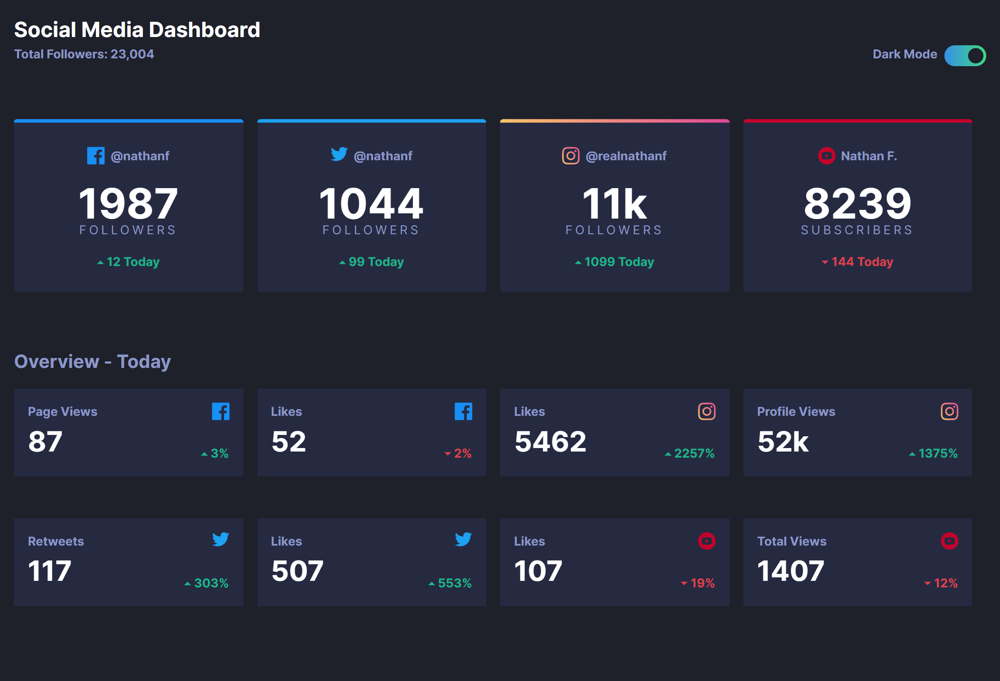

# Frontend Mentor - Social media dashboard with theme switcher solution

This is a solution to the [Social media dashboard with theme switcher challenge on Frontend Mentor](https://www.frontendmentor.io/challenges/social-media-dashboard-with-theme-switcher-6oY8ozp_H). Frontend Mentor challenges help you improve your coding skills by building realistic projects. 

## Table of contents

- [Overview](#overview)
  - [The challenge](#the-challenge)
  - [Screenshots](#screenshot)
  - [Links](#links)
- [My process](#my-process)
  - [Built with](#built-with)
  - [What I learned](#what-i-learned)
  - [Useful resources](#useful-resources)
- [Author](#author)

## Overview

### The challenge

Users should be able to:

- View the optimal layout for the site depending on their device's screen size
- See hover states for all interactive elements on the page
- Toggle color theme to their preference

### Screenshots



### Links

- Solution URL: [https://github.com/rufflehuffle/social-media-dashboard](https://github.com/rufflehuffle/social-media-dashboard)
- Live Site URL: [https://rufflehuffle.github.io/social-media-dashboard/](https://rufflehuffle.github.io/social-media-dashboard/)

## My process

### Built with

- Semantic HTML5 markup
- BEM Methodology
- SCSS
- Flexbox
- Mobile-first workflow

### What I learned
This project made me realize I have a lot more work to do when structuring HTML and CSS. I should have spent more time at the beginning figuring out repeating patterns. My .overview-card and .card classes ended up being quite similar, and they honestly could have been handled under the same class with a modifier to differentiate the two.

This project was also the first time I used BEM and SCSS. I throughly enjoyed having the order, though it was a bit of a pain at times. Definitely messed up the formatting somewhere, but it's only the first time so there's only improvement from here!

```html
<!-- First time using BEM! -->

<div class="card card--facebook">
  <span class="card__account">@nathanf</span>
  <span class="card__count">1987</span>
  <span class="card__title">Followers</span>
  <span class="card__change change change_positive">12 Today</span>
</div>
```
```scss
// First time using SCSS!

.card {
  --primary: hsl(208, 92%, 53%);
  --icon: url("../images/icon-facebook.svg");

  position: relative;
  display: flex;
  flex-direction: column;
  text-align: center;
  border-radius: 0.25rem;
  padding: 1rem;

  margin-top: 1rem;
  margin-bottom: 1rem;

  background: var(--card-bg);

  &:hover {
    background: var(--card-hover);
    cursor: pointer;
  }

  &:before {
    position: absolute;
    top: 0;
    left: 0;
    width: 100%;
    border-radius: 0.25rem 0.25rem 0 0;
    content: "";
    height: 0.25rem;
    background: var(--primary);
  }

  &__account {
    margin-top: 1rem;
    margin-bottom: 0.5rem;
    display: flex;
    justify-content: center;
    font-weight: 700;
    color: var(--text-secondary);

    &:before {
      height: 20px;
      content: var(--icon);
      margin-right: 0.4rem;
    }
  }

  &__count {
    font-size: 3rem;
    font-weight: 700;
    color: var(--text-primary);
  }

  &__title {
    text-transform: uppercase;
    color: var(--text-secondary);
    letter-spacing: 0.2rem;
    margin-top: -1rem;
    margin-bottom: 1rem;
  }

  &__change {
    font-weight: 700;
    margin-bottom: 0.5rem;
  }

  &--facebook {
    --primary: hsl(208, 92%, 53%);
    --icon: url("../images/icon-facebook.svg");
  }

  &--twitter {
    --primary: hsl(203, 89%, 53%);
    --icon: url("../images/icon-twitter.svg");
  }

  &--instagram {
    --primary: linear-gradient(to right, hsl(37, 97%, 70%), hsl(329, 70%, 58%));
    --icon: url("../images/icon-instagram.svg");
  }

  &--youtube {
    --primary: hsl(348, 97%, 39%);
    --icon: url("../images/icon-youtube.svg");
  }
}
```

### Useful resources

- [Get BEM](http://getbem.com/) - Used this website to read up on BEM and its methodology.
- [CSS-Tricks Flexbox Guide](https://css-tricks.com/snippets/css/a-guide-to-flexbox/) - Anytime I needed help with flexbox properties, I used this as my reference.

## Author

- Website - [Brandon Nguyen](https://rufflehuffle.github.io/)